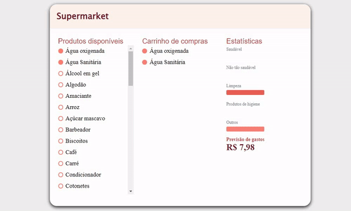

# Supermarket
## Projeto feito com a [AlgaWorks](https://www.youtube.com/watch?v=X2PLqqx_gtI)

  

 

## Características
- Criado com a biblioteca React
- Utiliza os hooks useEffect e useState
- Styled-components
- Componentes compartilhados

## O que faz
- Renderiza um Json com produtos
- Ao clicar em um produto disponível ele é adicionado ao carrinho de compras
- Ao clicar em qualquer produto do carrinho de compras ele é retirado
- O preço de todos produtos é atualizado e mostrado na tela, conforme o usuário clica para adicionar ou retirar produtos
- Há uma tabela com estatísticas sobre os produtos (produtos saudáveis, não tão saudáveis...)
